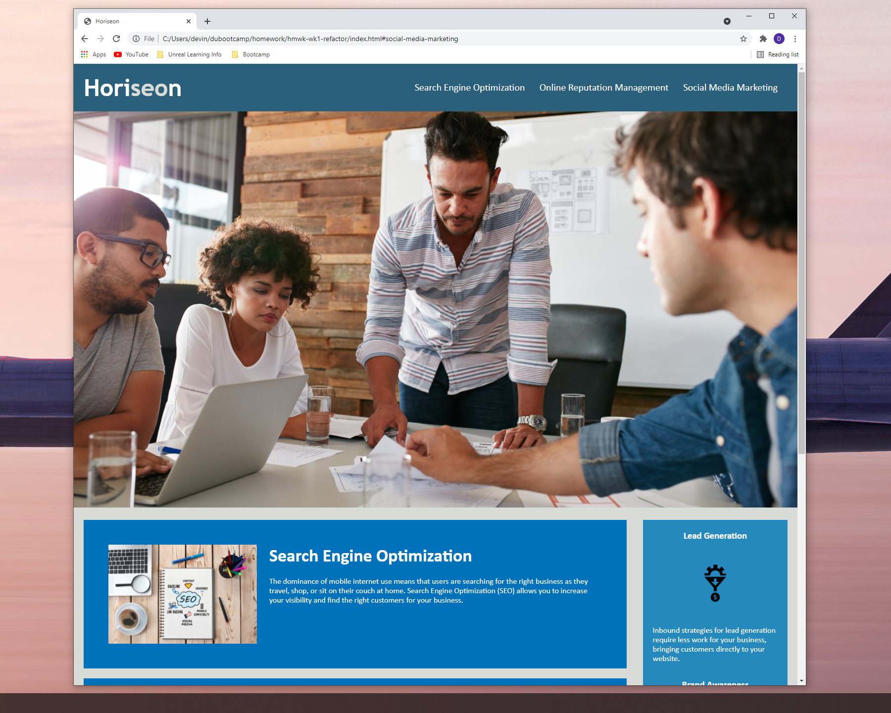

# <Devin's Week 1 Homework>

## Description
This project was used to guage my understanding of semantic html and the importance of readability and accessibility for websites to be successful. By creating a website using semantic elements, search engines and other machines will have an easier time reading my websites so it can reach a larger end user group. 

## Tasks completed
- Viewed the source code
- Applied semantic HTML elements
- Added appropriate alt attributes to images
- Added comments to describe CSS functions
- Added descriptive title

## To view the website 
Click on provided links:


## Example of website
Website can be viewed in a typical desktop web browser. Currently the site does not support smaller resolutions.

Provide instructions and examples for use. Include screenshots as needed.
To add a screenshot, create an `assets/images` folder in your repository and upload your screenshot to it. Then, using the relative filepath, add it to your README using the following syntax:
    ```md
    
    ```

## Credits
Credit for this project goes to my instructor, teachers assistant, and fellow students in the DUbootcamp who provided the information and resources I needed to complete this task.